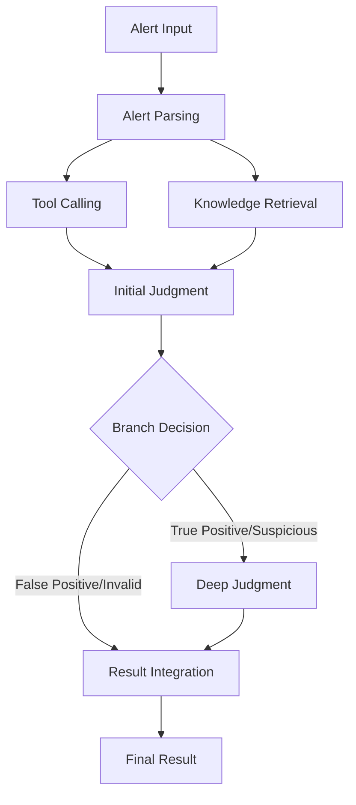

# Security Operations Center Agent (SOC Agent)

## Language
- [English](README.md) | [中文](docs/README_CN.md)

## Overview

The Security Operations Center Agent (SOC Agent) is an intelligent system designed to automate and enhance security alert analysis and response. It leverages advanced AI technologies, vector databases, and workflow automation to provide comprehensive security alert management and analysis capabilities.

## Table of Contents

- [System Architecture](#system-architecture)
- [Workflow Process](#workflow-process)
- [Core Features](#core-features)
- [Technology Stack](#technology-stack)
- [Installation](#installation)
- [Usage](#usage)
- [Use Cases](#use-cases)
- [Open Source Features](#open-source-features)
- [Screenshots](#screenshots)
- [API Documentation](#api-documentation)
- [Contributing](#contributing)
- [License](#license)

## System Architecture

The SOC Agent system consists of the following components:

1. **Frontend Interface**: Web-based UI built with HTML, CSS, and JavaScript
2. **Backend Server**: Go-based API server using Gin framework
3. **Workflow Engine**: Eino workflow engine for orchestrating alert analysis
4. **Vector Database**: Milvus for knowledge retrieval and similarity search
5. **Document Database**: MongoDB for storing alert data, analysis results, and configurations
6. **LLM Integration**: Integration with various language models for alert analysis
7. **Tool Integration**: MCP (Model Context Protocol) for tool calls and external integrations

## Workflow Process

The SOC Agent workflow follows a structured process for analyzing security alerts:



### Workflow Stages

1. **Alert Parsing**: The system parses raw alert data into a unified model format
2. **Tool Calling**: External tools are called to gather additional context and information
3. **Knowledge Retrieval**: Similar historical alerts and knowledge are retrieved from the vector database
4. **Initial Judgment**: An initial analysis is performed to categorize the alert
5. **Deep Judgment**: For suspicious or true positive alerts, a deeper analysis is conducted
6. **Result Integration**: All analysis results are integrated into a comprehensive response

## Core Features

### 1. Alert Analysis
- **Unified Alert Model**: Converts alerts from different sources into a standardized format
- **Multi-stage Analysis**: Combines initial judgment and deep analysis for comprehensive assessment
- **Context Enrichment**: Gathers additional context through tool calls and knowledge retrieval

### 2. Knowledge Management
- **Vector-based Retrieval**: Uses Milvus for similarity search of historical alerts
- **Continuous Learning**: Improves analysis accuracy through feedback loops
- **Knowledge Base Integration**: Incorporates external knowledge sources for better analysis

### 3. Workflow Automation
- **Visual Workflow Designer**: Allows for custom workflow creation and modification
- **Conditional Branching**: Automatically routes alerts based on analysis results
- **Tool Integration**: Seamlessly integrates with external security tools

### 4. User Interface
- **Dashboard**: Real-time visualization of alert statistics and trends
- **Alert Management**: Comprehensive alert lifecycle management
- **Knowledge Feedback**: User feedback system for continuous improvement

## Technology Stack

### Core Technologies
- **Backend**: Go 1.25.0, Gin framework
- **Frontend**: HTML5, CSS3, JavaScript
- **Workflow Engine**: Eino (CloudWeGo)
- **Vector Database**: Milvus
- **Document Database**: MongoDB
- **LLM Integration**: DeepSeek, Qwen3, Ollama embeddings
- **Tool Integration**: MCP (Model Context Protocol)

### Dependencies
- github.com/cloudwego/eino v0.7.36
- github.com/milvus-io/milvus-sdk-go/v2 v2.4.2
- go.mongodb.org/mongo-driver v1.12.1
- github.com/gin-gonic/gin v1.10.0
- github.com/bytedance/sonic v1.15.0

## Installation

### Prerequisites
- Go 1.25.0 or higher
- MongoDB 4.4+ 
- Milvus 2.4+ 
- Ollama (for embedding models)

### Installation Steps
1. Clone the repository
2. Install dependencies: `go mod download`
3. Configure the system in `config.yaml`
4. Start the server: `make run`

### Configuration

#### config.yaml Example
```yaml
# Server configuration
server:
  port: 8080
  host: 0.0.0.0

# MongoDB configuration
mongodb:
  uri: mongodb://localhost:27017
  database: soc_agent

# Milvus configuration
milvus:
  host: localhost
  port: 19530
  collection: alert_knowledge

# Embedding configuration
embedding:
  provider: ollama
  model: mxbai-embed-large
  base_url: http://localhost:11434

# Eino configuration
eino:
  trace_enabled: false
  cozeloop_api_token: ""
  cozeloop_workspace_id: ""

# MCP configuration
mcp:
  enabled: true
  api_key: "your-api-key"
  base_url: "https://api.example.com"
```

## Usage

### API Endpoints
- **POST /api/v1/alert/analyze**: Submit an alert for analysis
- **GET /api/v1/alert/history**: Retrieve alert analysis history
- **POST /api/v1/knowledge/retrieve**: Perform knowledge retrieval
- **POST /api/v1/feedback**: Submit feedback on analysis results

### Frontend Usage
1. Access the web interface at `http://localhost:8080`
2. Submit alerts through the "Alert Analysis" tab
3. View analysis history in the "Alert Operations" tab
4. Manage knowledge and provide feedback in the "Knowledge Feedback" tab

## Use Cases

### 1. Security Operations Center (SOC)
- **Alert Triage**: Automatically categorize and prioritize security alerts
- **Incident Response**: Accelerate incident investigation and response
- **Threat Hunting**: Proactively identify potential threats through pattern recognition

### 2. Managed Security Service Providers (MSSPs)
- **Scalable Analysis**: Handle large volumes of alerts from multiple clients
- **Consistent Analysis**: Ensure uniform alert assessment across client environments
- **Reporting**: Generate comprehensive reports for clients

### 3. Enterprise Security Teams
- **Reduced Alert Fatigue**: Filter false positives and prioritize critical alerts
- **Knowledge Preservation**: Capture and leverage security knowledge across the organization
- **Compliance**: Maintain audit trails and demonstrate security due diligence

## Open Source Features

### 1. Full Process Transparency
- **Open Workflow**: All workflow stages and decisions are visible and auditable
- **Explainable AI**: Analysis decisions include detailed reasoning
- **Configurable Rules**: Users can modify and extend analysis rules

### 2. Extensibility
- **Plugin Architecture**: Easy integration of new tools and models
- **Custom Workflows**: Create tailored analysis workflows for specific use cases
- **API-first Design**: Comprehensive API for integration with existing systems

### 3. Community Driven
- **Open Development**: Community contributions and improvements
- **Shared Knowledge**: Collective security intelligence from the community
- **Transparent Roadmap**: Publicly visible development plans

## Screenshots

### Knowledge Base Management


### Product Settings


### Alert Submission


### Analysis Result


## API Documentation

For detailed API documentation, please refer to the [API Documentation](reference/API_DOCUMENTATION.md) file.

## Contributing

We welcome contributions from the community. Please see our [Contributing Guidelines](CONTRIBUTING.md) for more information.

## License

This project is licensed under the [Apache 2.0 License](LICENSE).
