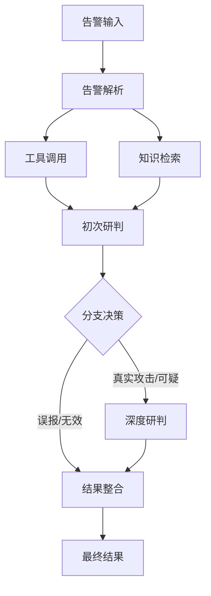

# 安全运营智能体 (SOC Agent)

## 语言
- [English](../README.md) | [中文](README_CN.md)

## 概述

安全运营智能体（SOC Agent）是一个智能系统，旨在自动化和增强安全告警分析与响应。它利用先进的AI技术、向量数据库和工作流自动化，提供全面的安全告警管理和分析能力。

## 目录

- [系统架构](#系统架构)
- [工作流流程](#工作流流程)
- [核心功能](#核心功能)
- [技术栈](#技术栈)
- [安装](#安装)
- [使用](#使用)
- [使用场景](#使用场景)
- [开源特点](#开源特点)
- [截图](#截图)
- [API文档](#api文档)
- [贡献](#贡献)
- [许可证](#许可证)

## 系统架构

安全运营智能体系统由以下组件组成：

1. **前端界面**：基于HTML、CSS和JavaScript的Web界面
2. **后端服务器**：使用Gin框架的Go语言API服务器
3. **工作流引擎**：Eino工作流引擎，用于编排告警分析流程
4. **向量数据库**：Milvus，用于知识检索和相似度搜索
5. **文档数据库**：MongoDB，用于存储告警数据、分析结果和配置
6. **大语言模型集成**：集成各种语言模型进行告警分析
7. **工具集成**：MCP（模型上下文协议），用于工具调用和外部集成

## 工作流流程

安全运营智能体工作流遵循结构化流程分析安全告警：



### 工作流阶段

1. **告警解析**：系统将原始告警数据解析为统一模型格式
2. **工具调用**：调用外部工具收集额外的上下文和信息
3. **知识检索**：从向量数据库中检索类似的历史告警和知识
4. **初次研判**：进行初步分析以对告警进行分类
5. **深度研判**：对可疑或真实攻击告警进行更深入的分析
6. **结果整合**：将所有分析结果整合为全面的响应

## 核心功能

### 1. 告警分析
- **统一告警模型**：将来自不同来源的告警转换为标准化格式
- **多阶段分析**：结合初次研判和深度分析进行全面评估
- **上下文丰富**：通过工具调用和知识检索收集额外上下文

### 2. 知识管理
- **基于向量的检索**：使用Milvus进行历史告警的相似度搜索
- **持续学习**：通过反馈循环提高分析准确性
- **知识库集成**：整合外部知识源以获得更好的分析结果

### 3. 工作流自动化
- **可视化工作流设计器**：允许自定义工作流创建和修改
- **条件分支**：根据分析结果自动路由告警
- **工具集成**：与外部安全工具无缝集成

### 4. 用户界面
- **数据看板**：实时可视化告警统计和趋势
- **告警管理**：全面的告警生命周期管理
- **知识反馈**：用户反馈系统，持续改进

## 技术栈

### 核心技术
- **后端**：Go 1.25.0, Gin框架
- **前端**：HTML5, CSS3, JavaScript
- **工作流引擎**：Eino (CloudWeGo)
- **向量数据库**：Milvus
- **文档数据库**：MongoDB
- **大语言模型集成**：DeepSeek, Qwen3, Ollama嵌入
- **工具集成**：MCP (模型上下文协议)

### 依赖
- github.com/cloudwego/eino v0.7.36
- github.com/milvus-io/milvus-sdk-go/v2 v2.4.2
- go.mongodb.org/mongo-driver v1.12.1
- github.com/gin-gonic/gin v1.10.0
- github.com/bytedance/sonic v1.15.0

## 安装

### 先决条件
- Go 1.25.0或更高版本
- MongoDB 4.4+ 
- Milvus 2.4+ 
- Ollama（用于嵌入模型）

### 安装步骤
1. 克隆仓库
2. 安装依赖：`go mod download`
3. 在`config.yaml`中配置系统
4. 启动服务器：`make run`

### 配置

#### 配置文件

安全运营智能体支持多个不同环境的配置文件。默认情况下，系统使用 `config.yaml`，但您可以创建特定环境的配置文件以适应不同的部署场景：

- `config.yaml` - 默认配置
- `config_dev.yaml` - 开发环境配置
- `config_test.yaml` - 测试环境配置
- `config_prod.yaml` - 生产环境配置

#### config.yaml 示例
```yaml
# 服务器配置
server:
  port: 8080
  host: 0.0.0.0

# MongoDB配置
mongodb:
  uri: mongodb://localhost:27017
  database: soc_agent

# Milvus配置
milvus:
  host: localhost
  port: 19530
  collection: alert_knowledge

# 嵌入模型配置
embedding:
  provider: ollama
  model: mxbai-embed-large
  base_url: http://localhost:11434

# Eino配置
eino:
  trace_enabled: false
  cozeloop_api_token: ""
  cozeloop_workspace_id: ""

# MCP配置
mcp:
  enabled: true
  api_key: "your-api-key"
  base_url: "https://api.example.com"
```

#### 切换配置文件

安全运营智能体使用 `SOC_AGENT_ENV` 环境变量来确定使用哪个配置文件。以下是如何在不同配置之间切换的方法：

1. **使用 Makefile 目标**（推荐）：
   - `make run` - 使用默认配置运行
   - `make run-dev` - 使用开发环境配置运行
   - `make run-test` - 使用测试环境配置运行
   - `make run-prod` - 使用生产环境配置运行

2. **直接使用环境变量**：
   ```bash
   # 使用开发环境配置运行
   SOC_AGENT_ENV=dev go run cmd/server/main.go
   
   # 使用测试环境配置运行
   SOC_AGENT_ENV=test go run cmd/server/main.go
   
   # 使用生产环境配置运行
   SOC_AGENT_ENV=production go run cmd/server/main.go
   ```

#### 何时使用不同的配置

- **开发** (`config_dev.yaml`)：
  - 用于本地开发和测试
  - 启用调试日志
  - 使用开发专用的数据库实例
  - 可能使用不同的测试 API 密钥

- **测试** (`config_test.yaml`)：
  - 用于自动化测试
  - 使用测试专用的数据库实例
  - 可能使用模拟服务作为外部依赖

- **生产** (`config_prod.yaml`)：
  - 用于生产部署
  - 启用生产级日志
  - 使用生产数据库实例
  - 使用真实的 API 密钥和服务

#### 配置切换故障排除

- **配置文件未找到**：如果您看到类似 "Config file config_[env].yaml not found, using default config.yaml" 的消息，这意味着指定的环境配置文件不存在。系统会自动回退到使用 `config.yaml`。

- **环境变量未被识别**：确保您正确设置了环境变量。在 Linux/macOS 上，在运行应用程序之前使用 `export SOC_AGENT_ENV=dev`。在 Windows 上，使用 `set SOC_AGENT_ENV=dev`。

- **配置值未被应用**：确保您在更改配置后重新启动应用程序。应用程序仅在启动时读取配置。

- **配置格式无效**：检查您的 YAML 文件是否格式正确。使用 YAML 验证器确保没有语法错误。

### 第三方组件安装

#### MongoDB 安装
1. **Ubuntu/Debian**:
   ```bash
   sudo apt update
   sudo apt install mongodb-org
   sudo systemctl start mongodb
   sudo systemctl enable mongodb
   ```

2. **CentOS/RHEL**:
   ```bash
   sudo yum install mongodb-org
   sudo systemctl start mongod
   sudo systemctl enable mongod
   ```

3. **Docker**:
   ```bash
   docker run -d --name mongodb -p 27017:27017 mongo:4.4
   ```

#### Milvus 安装
1. **使用Docker Compose**:
   ```bash
   wget https://github.com/milvus-io/milvus/releases/download/v2.4.0/milvus-standalone-docker-compose.yml -O docker-compose.yml
   docker-compose up -d
   ```

#### Ollama 安装
1. **Linux**:
   ```bash
   curl -fsSL https://ollama.com/install.sh | sh
   ```

2. **启动Ollama服务**:
   ```bash
   sudo systemctl start ollama
   sudo systemctl enable ollama
   ```

3. **拉取嵌入模型**:
   ```bash
   ollama pull mxbai-embed-large
   ```

## 使用

### API端点
- **POST /api/v1/alert/analyze**：提交告警进行分析
- **GET /api/v1/alert/history**：检索告警分析历史
- **POST /api/v1/knowledge/retrieve**：执行知识检索
- **POST /api/v1/feedback**：提交分析结果的反馈

### 前端使用
1. 在`http://localhost:8080`访问Web界面
2. 通过"告警分析"标签提交告警
3. 在"告警运营"标签中查看分析历史
4. 在"知识反馈"标签中管理知识并提供反馈

## 使用场景

### 1. 安全运营中心 (SOC)
- **告警分类**：自动对安全告警进行分类和优先级排序
- **事件响应**：加速事件调查和响应
- **威胁狩猎**：通过模式识别主动识别潜在威胁

### 2. 托管安全服务提供商 (MSSPs)
- **可扩展分析**：处理来自多个客户的大量告警
- **一致分析**：确保跨客户环境的统一告警评估
- **报告**：为客户生成全面的报告

### 3. 企业安全团队
- **减少告警疲劳**：过滤误报并优先处理关键告警
- **知识保存**：在组织中捕获和利用安全知识
- **合规**：维护审计跟踪并证明安全尽职调查

## 开源特点

### 1. 全流程透明
- **开放工作流**：所有工作流阶段和决策都是可见和可审计的
- **可解释AI**：分析决策包含详细的推理过程
- **可配置规则**：用户可以修改和扩展分析规则

### 2. 可扩展性
- **插件架构**：轻松集成新工具和模型
- **自定义工作流**：为特定用例创建量身定制的分析工作流
- **API优先设计**：与现有系统集成的全面API

### 3. 社区驱动
- **开放开发**：社区贡献和改进
- **共享知识**：来自社区的集体安全情报
- **透明路线图**：公开可见的开发计划

## 截图

### 知识库管理


### 产品设置


### 告警提交


### 研判结果


## API文档

详细的API文档，请参考[API文档](reference/API_DOCUMENTATION.md)文件。

## 贡献

我们欢迎社区贡献。请参阅我们的[贡献指南](CONTRIBUTING.md)了解更多信息。

## 许可证

本项目采用[Apache 2.0许可证](LICENSE)。